# Scalable Modeling – Growth Should Be an Advantage, Not a Challenge

This repository introduces a pragmatic toolbox for modeling scalable systems. I believe that every new system should be 
designed with scalability in mind, as scalability is a prerequisite for success — growth should be an advantage, not a 
challenge. Strong influences have been taken from Domain-Driven Design, EventStorming & CQRS but the end result does 
not purely follow either of those.

There are **three opportunities** and **three challenges** in scalability and understanding them takes you far already. 
Combining the opportunities & challenges with an **upfront modeling technique** provides a solid foundations for modeling
scalable systems.

## Table of Content

<!-- TOC -->
* [Scalable Modeling – Growth Should Be an Advantage, Not a Challenge](#scalable-modeling--growth-should-be-an-advantage-not-a-challenge)
  * [Table of Content](#table-of-content)
    * [Opportunities](#opportunities)
    * [Challenges](#challenges)
    * [The Upfront Modeling Technique](#the-upfront-modeling-technique)
  * [Event Centrism](#event-centrism)
  * [Event-Driven Architecture (EDA)](#event-driven-architecture-eda)
  * [Command Query Responsibility Segregation (CQRS)](#command-query-responsibility-segregation-cqrs)
* [More Justification - Why to Concentrate Domain Knowledge & Scalability](#more-justification---why-to-concentrate-domain-knowledge--scalability)
  * [Domain Knowledge is the Most Underrated Key to High Development Velocity and Quality](#domain-knowledge-is-the-most-underrated-key-to-high-development-velocity-and-quality)
  * [Scalability is Prerequisite of Success](#scalability-is-prerequisite-of-success)
* [Theory](#theory)
  * [Vertical & Horizontal Scalability](#vertical--horizontal-scalability)
  * [Event Sourcing](#event-sourcing)
  * [The Three Dimensions to Scalability](#the-three-dimensions-to-scalability)
    * [Scale Cube](#scale-cube)
    * [Decomposition](#decomposition)
    * [Duplication](#duplication)
    * [Partition](#partition)
* [Scalable Modeling](#scalable-modeling)
  * [Components](#components)
    * [Events](#events)
    * [Ubiquitous Language](#ubiquitous-language)
    * [Commands & State](#commands--state)
    * [Queries](#queries)
    * [Policies](#policies)
    * [Hotspots & Descriptions](#hotspots--descriptions)
    * [Consistency Boundaries](#consistency-boundaries)
  * [Challenges](#challenges-1)
    * [Deduplication](#deduplication)
    * [Tailoring Consistency](#tailoring-consistency)
    * [Time Travel](#time-travel)
  * [End Results](#end-results)
  * [Credits](#credits)
* [License For Using the Pictures](#license-for-using-the-pictures)
<!-- TOC -->

### Opportunities

1. **[Decomposition](#decomposition)** - scale by splitting different things
1. **[Duplication](#duplication)** - scale by cloning
1. **[Partition](#partition)** - scale by splitting similar things

**Immutability** plays key role in each aspect. 

### Challenges

1. **[Deduplication](#deduplication)** - as exactly-once delivery is impossible in distributed systems
1. **[Tailoring Consistency](#tailoring-consistency)** - as strong consistency is the wrong default
1. **[Time Travel](#time-travel)** - as distribution causes eventual consistency

### The Upfront Modeling Technique

Software is ultimately a **model** — a conceptual solution that, while invisible, solves real-world challenges. In
software engineering, three things matter: 
1. Understanding: **WHY** software is needed (understanding the **purpose** and the **problem** it should address)
2. Designing: **WHAT** is the **conceptual model** for the solution **<- HERE WE CONCENTRATE TO THIS**
3. Developing: **HOW** it is **implemented**

Domain knowledge should be the starting point in building the **conceptual model**:

> "It's developer (mis)understanding that's released in production, not the experts' knowledge."  
> _**Alberto Brandolini**_

Without a proper understanding of the domain, it's impossible to implement a conceptual model that accurately reflects
it. Effective collaboration with domain experts is essential to bridge this gap. **Events** are key in discovering the
domain and forming a shared understanding and language around it. 
**Therefore, we take an [event-centric](#event-centrism) approach**.

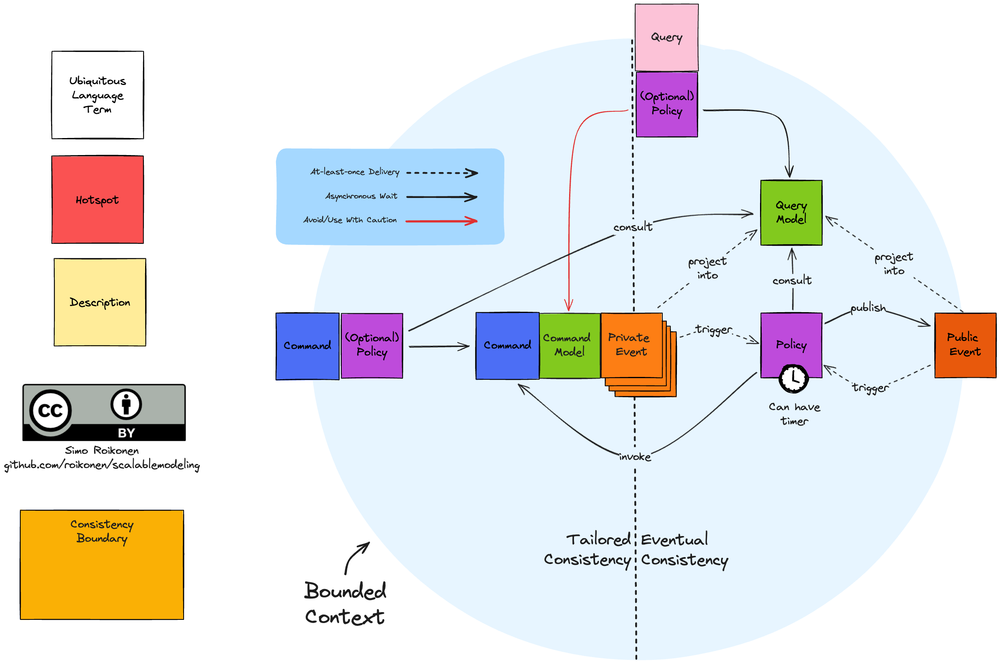

I understand that **querying the command model** (red arrow in the picture below) is a topic that often sparks strong
opinions. In my view, the command model serves as a special type of model that validates commands, and
while it is not designed for querying, there are cases where it can be read from if necessary. For example, in
in-memory command models [Akka-style](https://akka.io/), where the model is clustered, a valid use case might involve
querying the state of an entity immediately after its creation or update. Since the entity is already in memory,
fetching it quickly from there can be justified. However, querying the command model should be avoided wherever
possible, as there are many ways this can lead to misuse, such as introducing performance bottlenecks or
inconsistencies. For this reason, querying the command model requires strong justification.

## Event Centrism

In **Event Centrism**, everything we experience is either an event or a trace of one. Reality is not made up of *static 
objects* but a continuous flow of occurrences, where everything, from a falling leaf to a mountain, is part of an 
ongoing process. Even seemingly **permanent things** are *temporary outcomes* of past events, always subject to change.

Our lives are **driven by events** — every thought, action, and emotion is triggered by something, and memories are a 
collection of past events that define *who we are*. Traces of past events — like an old building or a weathered book — 
remind us of what once occurred, continuing to shape the present.

Events can also be *potential*, waiting to happen, or *hidden*, unfolding beyond our perception, like biological 
processes or distant cosmic phenomena. Every event is part of a **cause-and-effect continuum**, influencing future 
occurrences. **Time**, in this view, is meaningful only as the medium through which events unfold.

Even the **self** is an ongoing event, constantly shaped by experiences and interactions. In *Event Centrism*, 
everything in life is *fluid, dynamic, and interconnected*, emphasizing that our world and our identities are in 
constant motion, driven by the events we experience.

**Event Centrism** is not an *absolute truth* but rather one way to understand the world — a very useful way to *model 
systems*.

## Event-Driven Architecture (EDA)

Event-Driven Architecture (EDA) is a design pattern where systems react to events in near real-time. Components 
communicate by producing, detecting, and responding to events, enabling asynchronous processing and loose coupling 
between services, which allows for more scalable and resilient systems.

## Command Query Responsibility Segregation (CQRS)

CQRS is a pattern that separates the responsibilities of updating data (commands) and reading data (queries). By 
dividing these operations, CQRS improves performance, scalability, and security, allowing for more efficient handling 
of complex, high-demand systems.

Scalable Modeling does not go into purism in CQRS - in Scalable Modeling queries can (when well justified) also query command models for 
improved consistency where it does not jeopardise the scalability. Commands can also return simple data like sequence number of the produced events. 

# More Justification - Why to Concentrate Domain Knowledge & Scalability

## Domain Knowledge is the Most Underrated Key to High Development Velocity and Quality

> "A complex system that works is invariably found to have evolved from a simple system that worked."
> _**John Gall**_

Design flaws in the simple system tend to compound and lead to exponentially increasing complexity in the complex system.

> "It's developer (mis)understanding that's released in production, not the experts' knowledge."
> _**Alberto Brandolini**_

Without a proper understanding of the domain, it's impossible to implement a conceptual model that accurately reflects it. Effective collaboration with domain experts is essential to bridge this gap.

> "Doing the wrong thing right is not nearly as good as doing the right thing wrong."
> _**Russel L. Ackoff**_

Without a proper understanding of the domain, it's easy to prioritize technical correctness over solving the actual problem.

> "Organizations which design systems are constrained to produce designs which are copies of the communication structures of these organizations."
> _**Melvin E. Conway**_

Conceptual models derived from the domain often lead to software structures that should mirror the communication patterns within the organization.

> "Civilization advances by extending the number of important operations which we can perform without thinking of them."
> _**Alfred North Whitehead**_

When we can focus solely on implementing conceptual models from the domain without worrying about the technical details we can abstract away, we achieve the highest velocity.

## Scalability is Prerequisite of Success

Building a scalable foundation allows businesses to adapt to increasing demands and capitalize on opportunities without being limited by technical constraints. As these influential leaders have noted, scalability is not an afterthought; it is integral to achieving sustainable success.

Without a scalable system from day one, even the best ideas can be slowed down by bottlenecks and inefficiencies as they grow. Designing with scalability in mind ensures that as demand increases, systems can grow exponentially to meet those demands without sacrificing performance or creating technical debt.

> "The faster you scale, the more wealth you create."
> _**Reid Hoffman** (Co-founder of LinkedIn)_

> "In order to win, you must be able to scale exponentially."
> _**Marc Andreessen** (Founder of Andreessen Horowitz)_

> "The most scalable businesses in the world are software businesses."
> _**Bill Gates** (Founder of Microsoft)_

Success is not just about growing fast—it's about building the right infrastructure from the outset, so that growth becomes an advantage, not a challenge.

# Theory

## Vertical & Horizontal Scalability

## Event Sourcing

## The Three Dimensions to Scalability

In this chapter we are in the context of:
* Event-Driven Architecture (EDA)
* Command Query Separation (CQS)
* Command Query Responsibility Segregation (CQRS)

### Scale Cube

### Decomposition

### Duplication

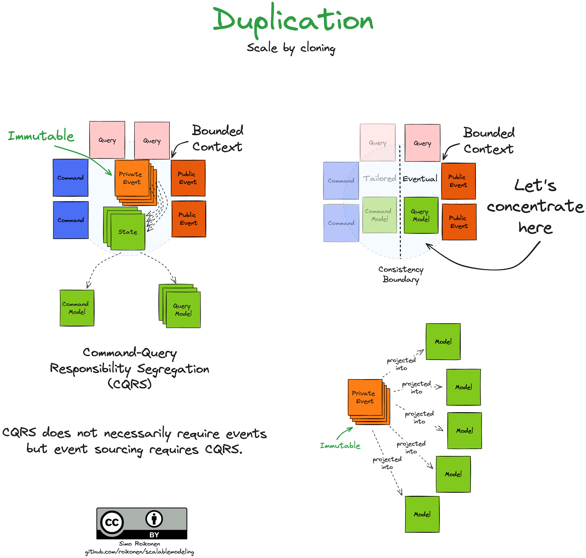

### Partition

# Scalable Modeling

## Components

1. [Events](#events)
2. [Ubiquitous Language](#ubiquitous-language)
3. [Commands & State](#commands--state)
4. [Queries](#queries)
5. [Policies](#policies)
6. [Hotspots & Descriptions](#hotspots--descriptions)
7. [Consistency Boundaries](#consistency-boundaries)

### Events

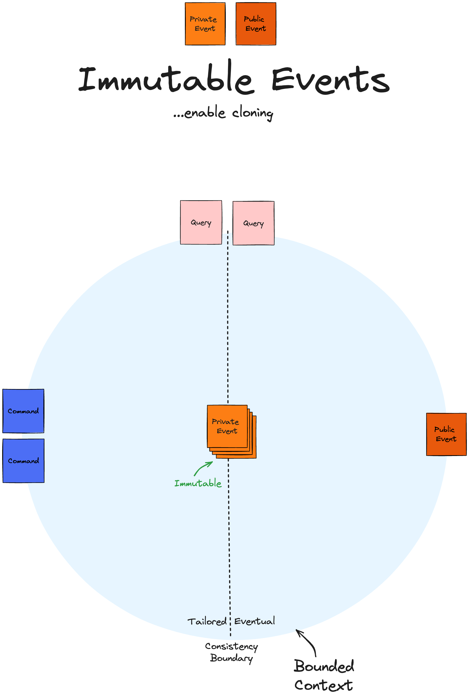

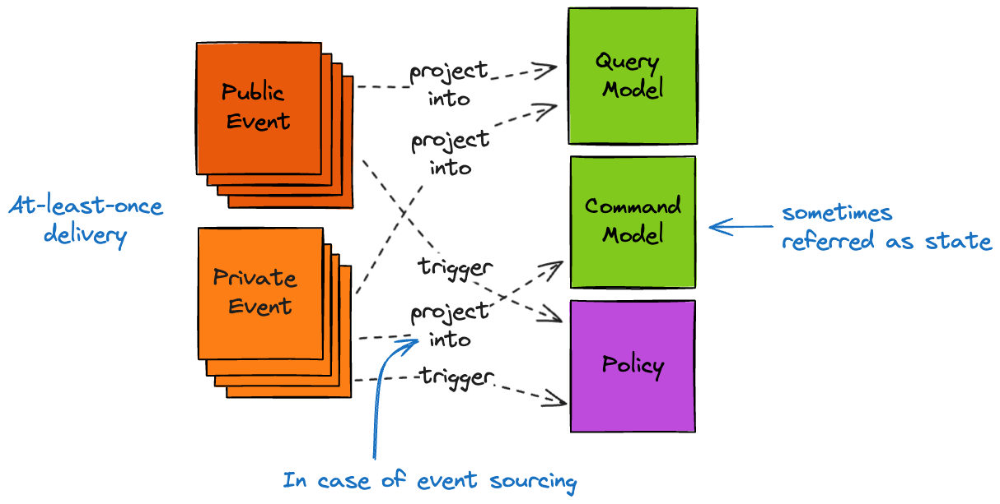

### Ubiquitous Language

### Commands & State

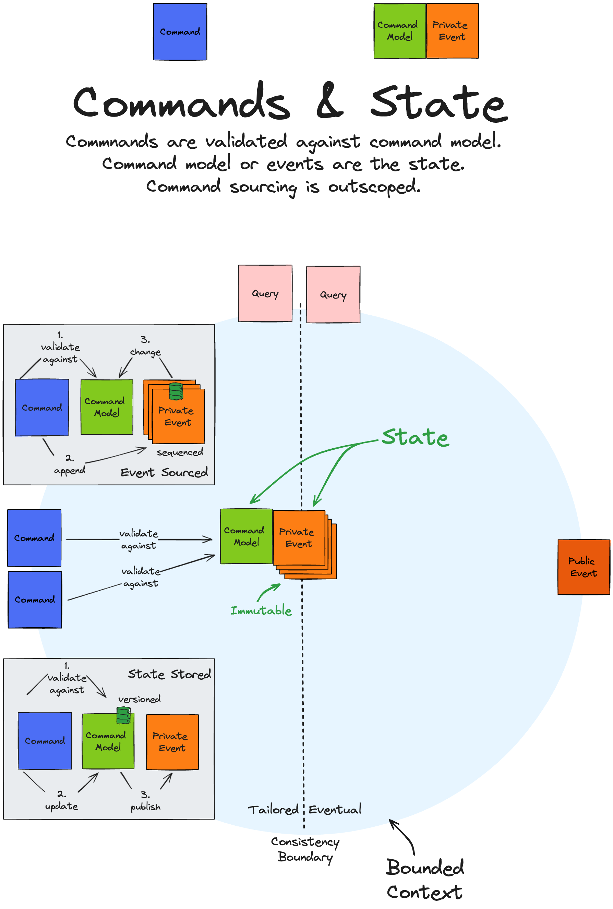

### Queries

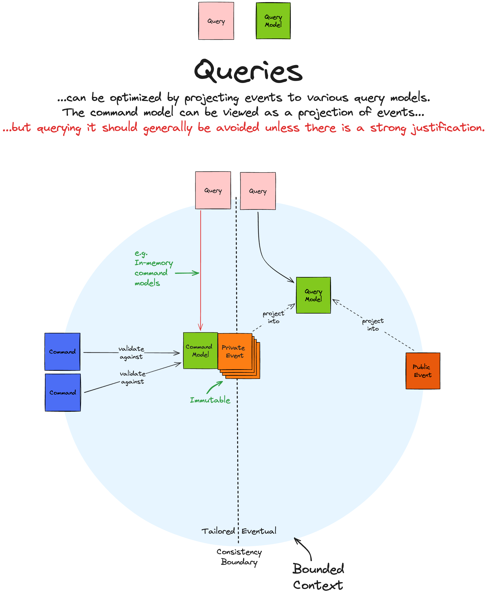

### Policies

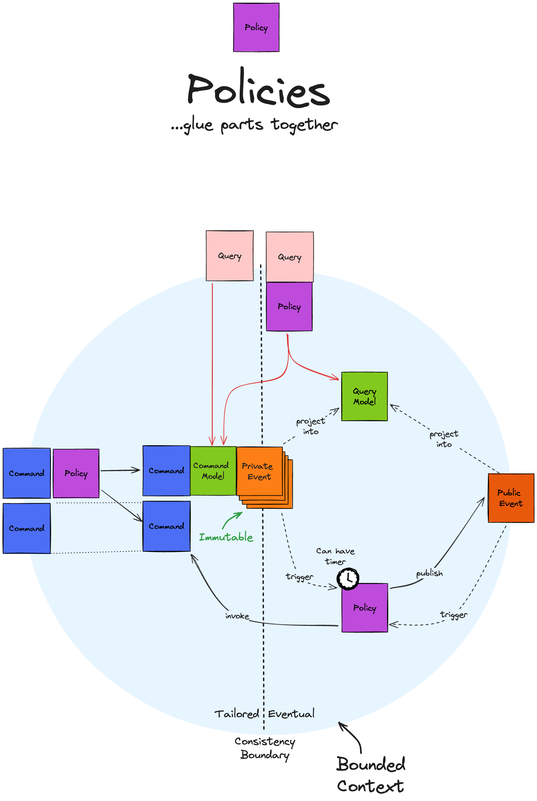

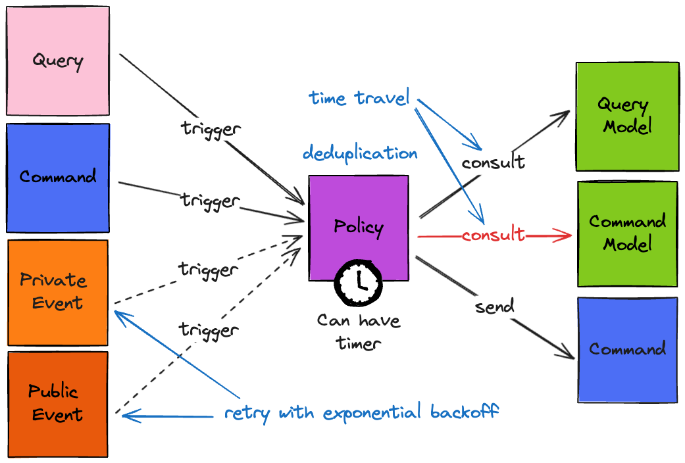

### Hotspots & Descriptions

### Consistency Boundaries

## Challenges

### Deduplication

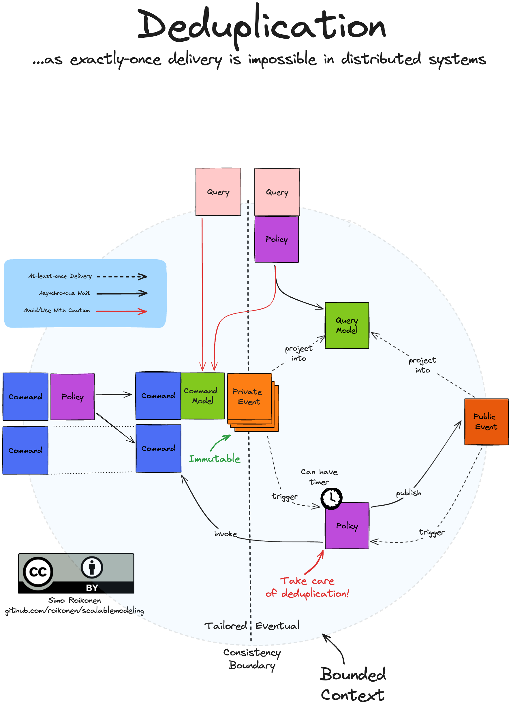

### Tailoring Consistency

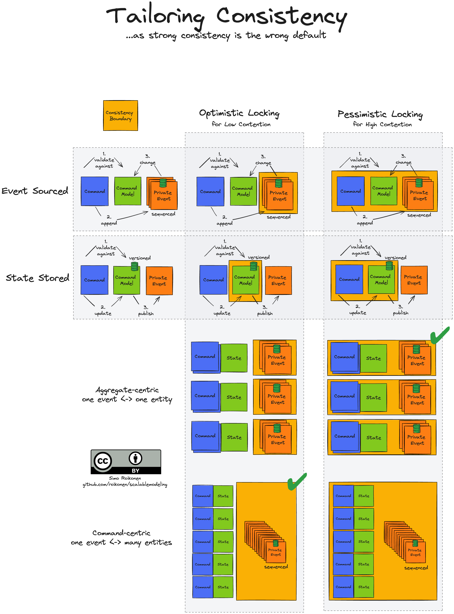

### Time Travel

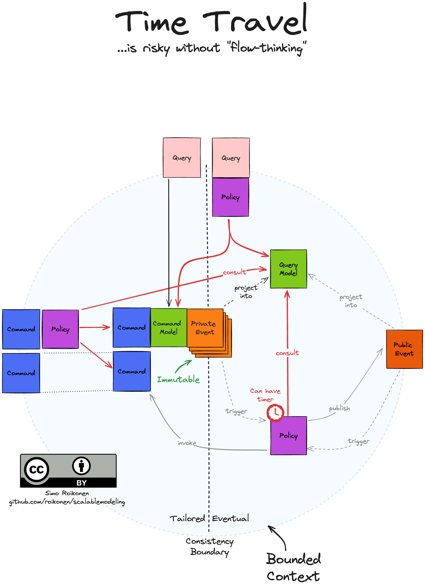

## End Results

## Credits

The following persons have had a lot of influence on what this repository describes:

* **Alberto Brandolini**: Creator of *Event Storming*, a collaborative workshop technique used to explore and model 
  complex business processes through domain events. His approach helps teams rapidly gain insights into business 
  domains by focusing on key events that drive processes.

* **Eric Evans**: Known for pioneering *Domain-Driven Design (DDD)*, a software development philosophy that emphasizes 
  aligning the software model closely with the business domain. His work focuses on creating a shared understanding 
  between technical teams and domain experts to ensure the software reflects real-world complexity.

* **Gregory Young**: Renowned for developing and promoting *Command Query Responsibility Segregation (CQRS)* and 
  *Event Sourcing*. His work centers on separating read and write operations in systems, improving scalability, 
  and using event sourcing to maintain the history of all changes in a system, offering resilience and insights 
  into past system states.

# License For Using the Pictures

See [License](LICENSE.md).
