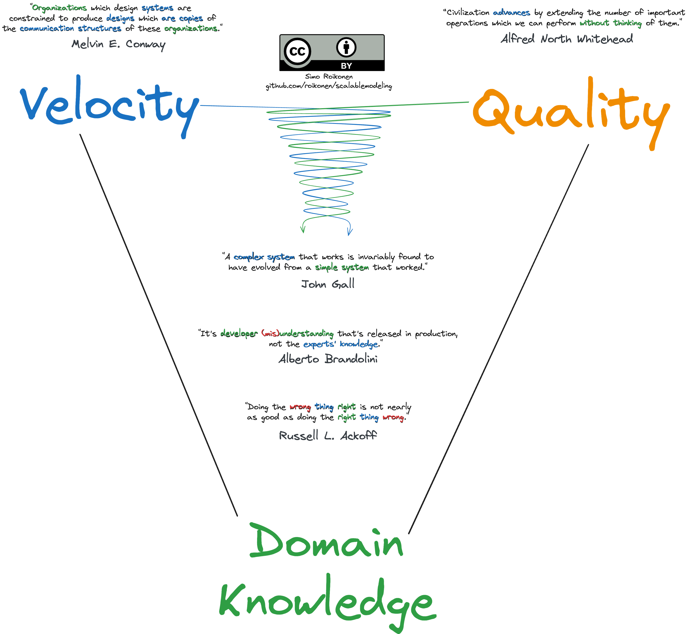

# Components of Modeling EDA & CQRS Systems

# Justification

## Domain Knowledge is the Key to High Development Velocity & High Outcome Quality

## Success Requires Scalability

# Theory

## Vertical & Horizontal Scalability

## Event Sourcing

## Three Dimensions to Scalability

### Scale Cube

### Decomposition

### Duplication

### Partition

# Modeling EDA & CQRS Systems

## Components

## Challenges

# License

See [License](LICENSE.md).