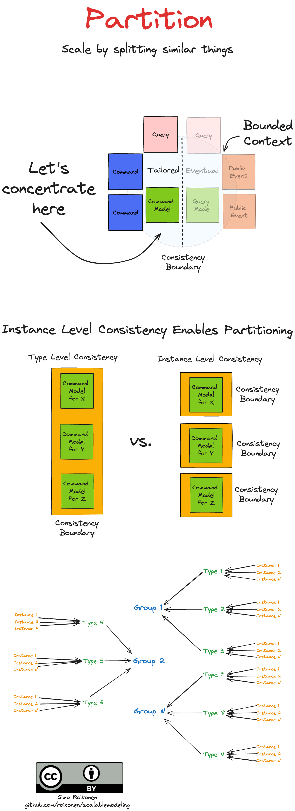

# Components of Distributed Systems Modeling (EDA & CQRS)

# Justification - Why to Concentrate Domain Knowledge & Scalability

## Domain Knowledge is the Most Underrated Key to High Development Velocity and Quality

> "A complex system that works is invariably found to have evolved from a simple system that worked."
> _**John Gall**_

Design flaws in the simple system tend to compound and lead to exponentially increasing complexity in the complex system.

> "It's not the domain expert's knowledge that is released to production; it's the programmer's knowledge."
> _**Alberto Brandolini**_

Without a proper understanding of the domain, it's impossible to implement a conceptual model that accurately reflects it. Effective collaboration with domain experts is essential to bridge this gap.

> "Doing the wrong thing right is not nearly as good as doing the right thing wrong."
> _**Russel L. Ackoff**_

Without a proper understanding of the domain, it's easy to prioritize technical correctness over solving the actual problem.

> "Organizations which design systems are constrained to produce designs which are copies of the communication structures of these organizations."
> _**Melvin E. Conway**_

Conceptual models derived from the domain often lead to software structures that should mirror the communication patterns within the organization.

> "Civilization advances by extending the number of important operations which we can perform without thinking of them."
> _**Alfred North Whitehead**_

When we can focus solely on implementing conceptual models from the domain without worrying about the technical details we can abstract away, we achieve the highest velocity.

## Scalability is Prerequisite of Success

Building a scalable foundation allows businesses to adapt to increasing demands and capitalize on opportunities without being limited by technical constraints. As these influential leaders have noted, scalability is not an afterthought; it is integral to achieving sustainable success.

Without a scalable system from day one, even the best ideas can be slowed down by bottlenecks and inefficiencies as they grow. Designing with scalability in mind ensures that as demand increases, systems can grow exponentially to meet those demands without sacrificing performance or creating technical debt.

> "The faster you scale, the more wealth you create."
> _**Reid Hoffman** (Co-founder of LinkedIn)_

> "In order to win, you must be able to scale exponentially."
> _**Marc Andreessen** (Founder of Andreessen Horowitz)_

> "The most scalable businesses in the world are software businesses."
> _**Bill Gates** (Founder of Microsoft)_

Success is not just about growing fast—it's about building the right infrastructure from the outset, so that growth becomes an advantage, not a challenge.

# Theory

## Vertical & Horizontal Scalability

## Event Sourcing

## The Three Dimensions to Scalability

### Scale Cube

### Decomposition

### Duplication

### Partition

# Modeling EDA & CQRS Systems

## Components

## Challenges

# License

See [License](LICENSE.md).