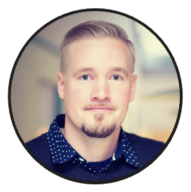

# Simo Roikonen



Simo is a seasoned software crafter, solution architect, communicator and learner, with a deep commitment to building 
evolvable, long-lasting backends. With over a decade of experience in [Domain-Driven Design](README.md#eric-evans), 
Simo excels at transforming complex problems into clear, actionable solutions. When systems require scaling and 
resilience, he brings a proven track record in **distributed architectures and scalability**, delivering low-latency at any 
scale.

Beyond the technical aspects, Simo understands that successful software development & high development velocity thrives 
in a balanced sociotechnical environment. He values collaboration and brings stakeholders together to ensure smooth 
progress, whether it's a modernization effort, greenfield project, or eliminating bottlenecks in existing systems. 
Simo is adept at crafting solutions that meet both technical and organizational needs, ensuring systems that are 
robust, scalable, and future-ready.

### System Modernization
Simo has extensive experience in modernizing complex, large-scale systems — a process that involves not only
experimenting, organizing, and communicating, but also leveraging modern technologies and architectures. Modernization,
in Simo’s view, is a sociotechnical exercise where he has consistently served as a hands-on technical leader.

### Removing Bottlenecks
Bottlenecks should only exist for a purpose. While unwanted bottlenecks can often be addressed through optimization,
he recognizes that more robust solutions, like horizontal scalability and distribution, are frequently necessary to
achieve sustainable growth and performance.

### Domain-Driven Design
In complex domains achieving both high quality and development velocity depends on creating a shared language that
everyone — from developers to stakeholders — can understand. This alignment is the secret sauce of success, as building
complex systems is, at its core, a process of communication.