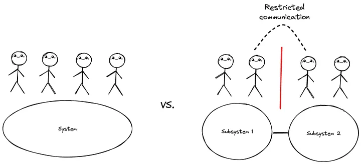
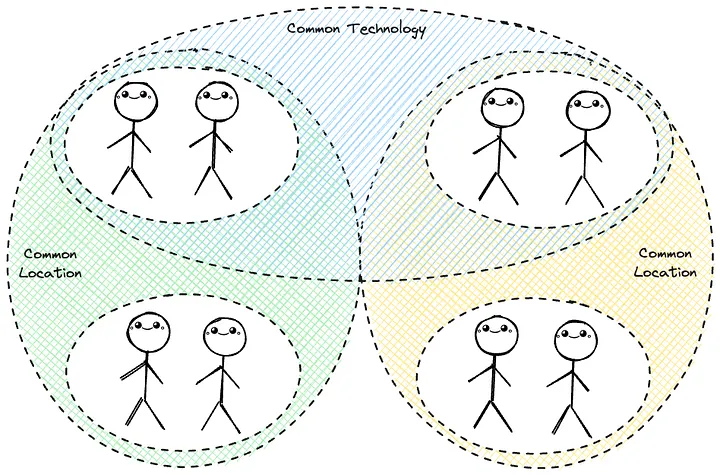
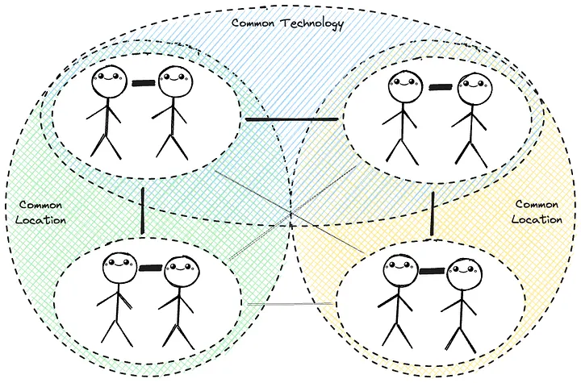
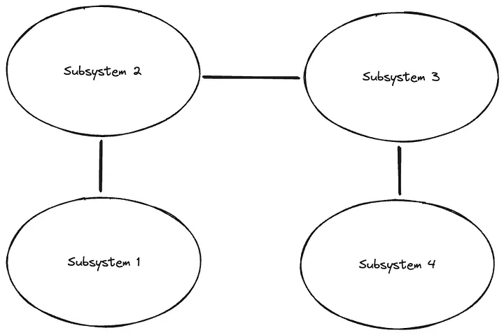
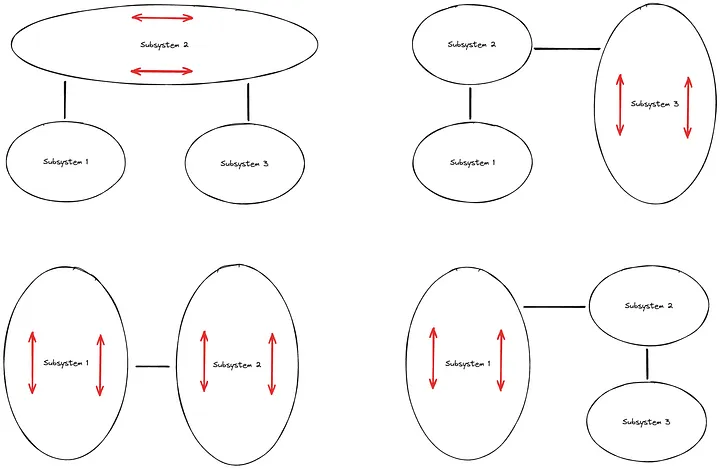
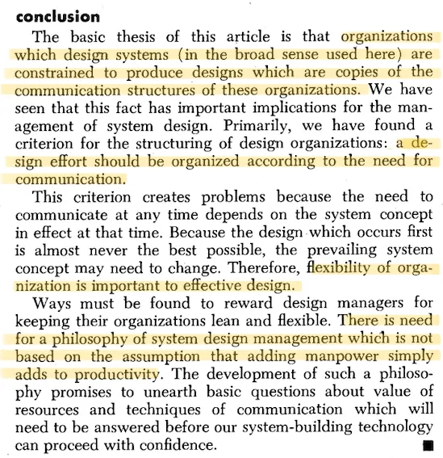

---
date:
  created: 2024-03-12
---

# Beyond the Stack: How Organizational Structure Shapes Software Architecture

The work of a software architect is highly technical, and that is also how the role is commonly perceived. However, what often gets overlooked is the **sociological aspect** of this discipline. No matter how well the architecture is described, the success of putting it into practice ultimately depends on the collaboration and understanding among the people involved.

## Software architecture reflects social dispersion

It’s common sense that if we restrict communication channels between teams building a solution, the resulting software architecture is likely to mirror this fragmentation.

/// caption
Restricting communication can lead to a push towards siloing
///

Let’s also consider a bit more complicated scenario where different teams are responsible for various layers of the software stack. Layers could include, for example, frontend, backend and database. Each team, focusing on its specialized layer, may unintentionally create a system that lacks cohesion and seamless integration. Technological boundaries are just one example among many other boundaries like business domains, availability, or location.

To spice up the scenario, let’s add a second boundary in addition to technology: location. Physical separation, be it due to geographical distances or departmental divisions, can also leave its imprint on the architecture. If your development group is split across two different locations, with local subgroups communicating face-to-face daily, expect the architecture to reflect this physical dispersion.

When speaking the same (technological or other) ubiquitous language, the communication is much more efficient. Same thing when communicating face to face, it is just more effortless than communication via technical communication channels.

## Communication follows the path of least resistance

Communication tends to naturally follow the path of least resistance, favoring the most effortless channels.

/// caption
Natural communication flows
///

In the example organization shown above, it makes sense that the resulting system structure would naturally start to resemble the picture below due to the least resistance principle.

## Underlying forces at play

As we consider reshaping the architecture, it’s crucial to acknowledge and understand the strong underlying forces that may attempt to revert it to its original form.

/// caption
Underlying forces trying to fragment the architectural attempts
///

To address these challenges, we need to make thoughtful changes in how our organization communicates. This involves adjusting the way teams interact, tackling the issues also raised by **Conway’s Law**, as outlined by _Melvin Conway_ in his 1968 article [“How Do Committees Invent?”](https://www.melconway.com/Home/pdf/committees.pdf).

## Conway's Law

!!! quote "Melvin E. Conway, How Do Committees Invent?"

    Organizations which design systems are constrained to produce designs which are copies of the communication structures of these organizations.

Conway’s Law challenges the traditional notion of architecture as a purely technical discipline. It emphasizes the social fabric within an organization, asserting that the patterns of communication, collaboration, and cooperation are integral to shaping the software architecture.

/// caption
Conclusions from the article “How Do Committees Invent?” by Melvin Conway
///

While Conway’s Law is a conceptual framework rather than a law in the scientific sense, there is empirical evidence and anecdotal support that suggests its validity in various contexts. Several case studies and observations in the field of software development and organizational behavior provide evidence that aligns with Conway’s Law.

Understanding Conway’s Law provides a roadmap for intentional and positive architectural design and raises the question: **Should you design your organization with the awareness that how your teams are structured will inevitably shape the software they create?** The answer is yes.

## Guiding force for positive change

The exciting prospect lies in transforming Conway’s Law from a constraint into an asset through the implementation of the Inverse Conway Maneuver. This proactive strategy empowers teams to deliberately shape communication and collaboration structures within an organization, leading to a positive impact on and enhancement of the resulting software architecture. **Instead of simply adapting to existing communication patterns, teams take charge by intentionally designing the organizational structure to align with their desired outcomes in software development.**

Implementing the following principles can help ensure that your organization’s structure fosters a conducive environment for positive software development outcomes:

1. **Cross-functional Collaboration:** Encourage collaboration across different disciplines. Break down the barriers that lead to siloed thinking and foster a culture of shared goals.
2. **Flexible Team Structures:** Design teams with flexibility in mind. Adapt to the evolving needs of the project rather than sticking rigidly to predefined roles.
3. **Open Communication Channels:** Emphasize open and transparent communication. This not only includes formal channels but also informal ones, encouraging spontaneous exchanges of ideas and information.
4. **Shared Vision and Goals:** Ensure that teams share a common vision and goals. Aligning everyone towards a unified objective helps create a cohesive software architecture that reflects the organization’s overarching mission.

By intentionally incorporating these principles into your organizational structure, you leverage Conway’s Law as a guiding force for positive change. Your software architecture becomes a reflection of a well-aligned and collaborative team, resulting in more robust and effective solutions.

## Conclusions

As communication follows the path of least resistance and as building a larger scale solution is all about communication it is natural that the architecture starts to resemble the natural communication flows within the organization building it. We can leverage this by encouraging cross-functional collaboration, making team structures flexible, opening communication restrictions and putting effort into sharing vision and goals. The software architecture and communication structures go hand in hand and therefore software architecture is a sociotechnical discipline.