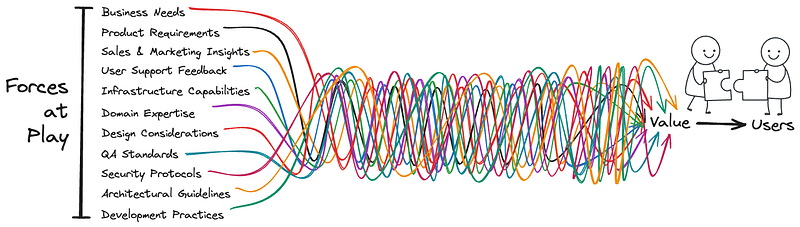
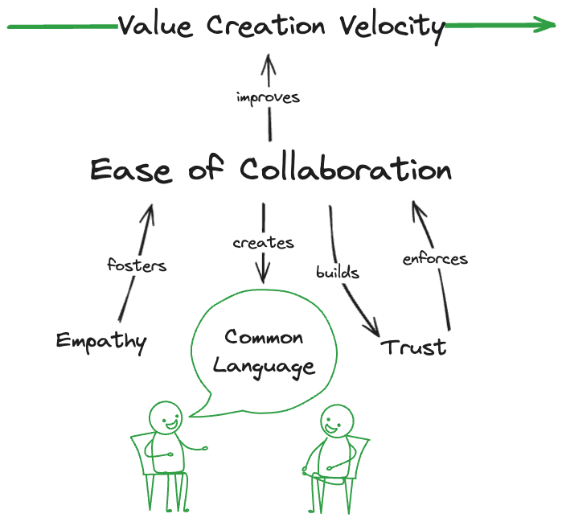
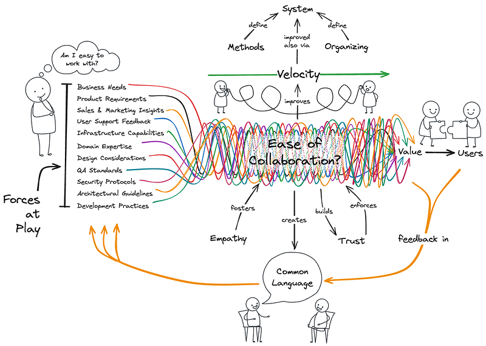

---
date:
  created: 2024-10-01
---

# SW Skills Underrated: Being Easy to Work With

What are some ways you’ve worked on **becoming easy to work with**? Asking for a friend… 👀

Let’s face it, some folks are just easy to work with, and it doesn’t always have anything to do with having the same goals or interests. From my experience, those who are easy to work with tend also to be successful in their careers. I believe **being easy to work with** is essential for success in any field, but it’s **especially important in software engineering**.

## Why do I believe being easy to work with is especially important in software engineering?

Software is ultimately a **model**, a conceptual solution that, while invisible, solves real-world challenges. In software engineering, two things matter: the **conceptual solution** (designing the _what_) and how it is **implemented** (developing the _how_). End users usually care much less about the technical details than about how well the solution solves their problems, so **conceptual solution** needs to be rock solid. This is where things like **Domain-Driven Design**, **Systems Thinking** & **Residuality Theory** for example, can help.

Great software design happens through iterative teamwork where people from diverse backgrounds come together to tackle complex, abstract problems and shape this conceptual solution. The challenge isn’t just technical: because of our diverse mental models, **people often speak the same language but mean different things**. For software success, teams need to create a **shared language** through **conversations** that ensure alignment on key terms and ideas. One efficient technique to use here is **EventStorming**, a collaborative workshop method that helps teams map out complex processes.

This is where **being easy to work with** becomes critical. In an industry that often focuses on technical skills, the ability to foster productive, clear, and empathetic communication can be the 𝘳𝘦𝘢𝘭 difference between project success and failure. When you’re easy to work with, you make those conversations productive and create the shared understanding that drives success.

## Here’s how I’ve tried to practice it:

1. **Be clear and concise** in communication to reduce misunderstandings (you get extra points for adding an agenda to meeting invitations).
1. **Listen actively** to understand others’ perspectives before jumping to conclusions (you know, instead of nodding while thinking about the next thing you want to say).
1. **Stay open to feedback** and adjust your approach when needed. Maintain a positive attitude, especially when facing challenges or disagreements (a smile during tough moments goes a long way).
1. **Foster trust and empathy** by showing genuine care for others’ perspectives and creating a supportive environment. Trust grows when people feel understood and valued, making collaboration smoother and more effective.

I truly believe that **being easy to work with** is the most underrated skill in the tech-focused software industry, and it just might be the key to your success. So, how do you ensure you’re easy to work with on your team?