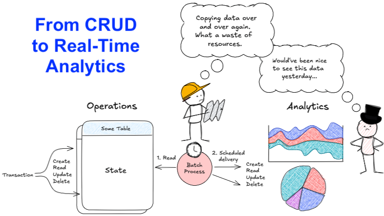
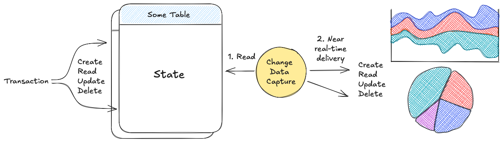
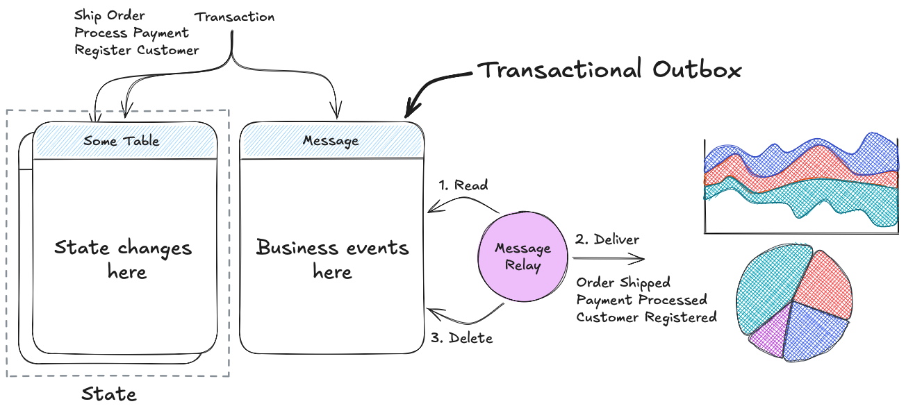
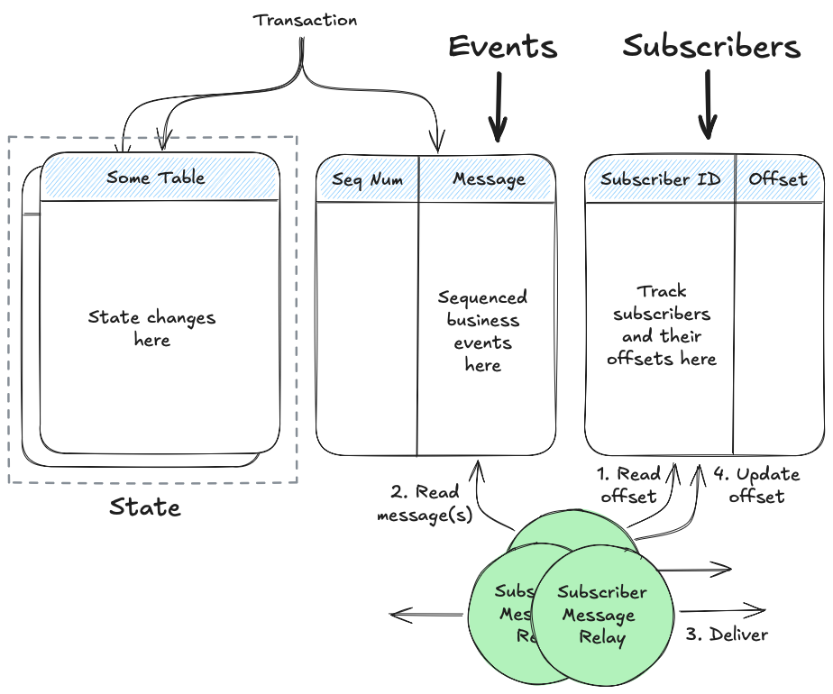
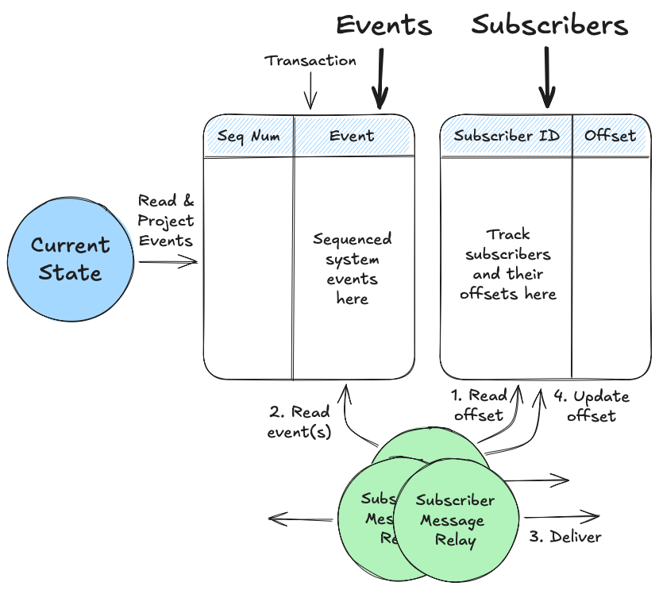

---
date:
  created: 2025-01-07
---

# From CRUD to Real-Time Analytics: Why Business Events Matter

Many **operational systems** (e.g. SaaS platforms and transactional systems) are built around **CRUD operations** and **batch processing**, but these approaches often fall short when businesses demand **real-time insights**.

A common intermediate step is **Change Data Capture (CDC)**, which reflects changes at the database level in near-real time. However, CDC primarily captures **raw data changes** (e.g., inserts, updates, deletes) and doesn’t provide the context of what those changes mean in the real world. For example, CDC might log an update to a database row, but it doesn’t tell you that the event was actually an *“Order Shipped”*.

This is where **business events** come in. Business events are **high-quality**, **domain-specific data**: they describe meaningful occurrences like _“Payment Processed”_ or _“Customer Registered”._ Unlike raw data changes, these events provide the context and structure needed to power **real-time analytics** and unlock the full potential of **AI and machine learning**. These events, often called **domain events**, form the backbone of event-driven systems.

## Business/Domain Events in Practice

For reliably generating, publishing and consuming these domain events, patterns like the **transactional outbox**, **subscription**, and **event sourcing** play crucial roles:

* **Transactional outbox** ensures that events are published consistently as part of the same database transaction that writes the underlying data, providing robustness even during failures.

* **Subscription pattern** enables systems to listen for and react to specific events in near real-time, enabling event-driven workflows and processes.

* **Event sourcing** goes further by making events the source of truth, storing all changes as an immutable sequence of events — empowering systems with a full audit history and the ability to reprocess or replay events at any time.

By adopting **event-driven architectures** and producing **event streams**, organizations can move beyond traditional paradigms. This approach enables:

**Timely, actionable insights** through real-time analytics.
**A foundation of rich, contextual data** for AI and ML applications.
**Real-time notifications** to trigger actions and inform stakeholders instantly.
Better system design with **domain-driven thinking** at the core.

**Conclusion:** Core domains in modern scalable operational systems should embrace business/domain events over Change Data Capture (CDC). Domain-driven design and event-driven architecture pave the way for creating future-proof systems.

**[Scalable modeling](../../index.md) as an event-centric approach provides a strong foundation for building long-lasting operational systems that deliver low latency and enable real-time analytics at any scale.**